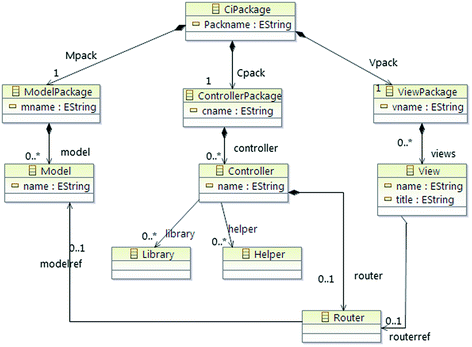
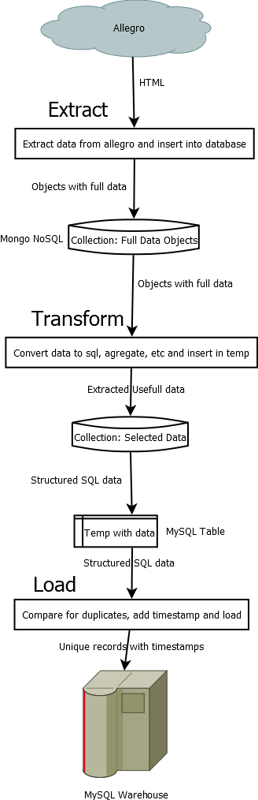
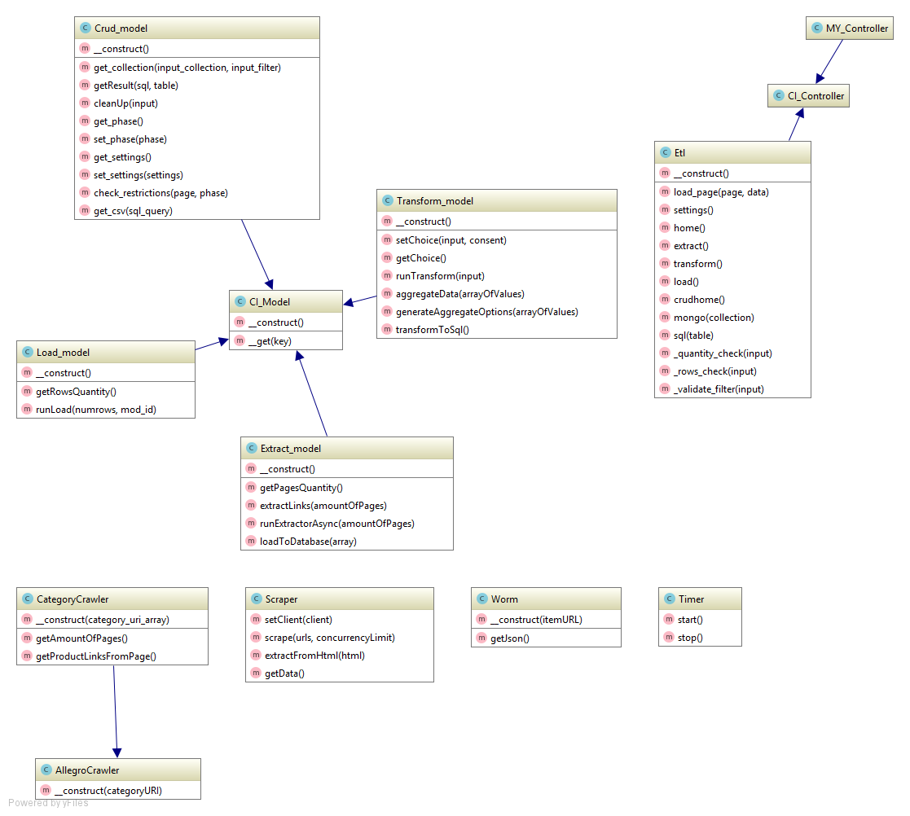

# Model-View-Controller

Application is developed using Model-View-Controller programming pattern.

Application makes use of one central controller, 4 models and a bucket of views.

Views render and present data to user. Models retrieve and process data from data-sources such as remote Allegro pages
and databases. Controller passes data between views, models and also handles URL routing for the web pages.

The following graphic illustrates how data flows through the MVC system. 

Structure, which was presented above is supported by following system, implemented in the core of the CodeIgniter framework.

# Application Flow

Detailed application flow chart is as follows:

## How does it work?

### Extract
* Extract scraps first page of the provided category and presents user amount of pages in this category.
* User specifies amount of pages which he wants to extract and hits the `EXTRACT` button.
* Application loops through through category pages and collects links to products from each page. Each page contains about 64 links.
* Object of the class `Symfony\Domcrawler` is created for each product page, which emulates web-browser and opens the page.
* Crawlers are sent in a multi-threaded manner, in a queue 10 at a time.
* After getting the page Crawler cuts out part of the javascript in this page which contains json object of a product which is described at this page.
* Object is processed using regex and some logic and is validates as a proper json-object.
* Json-object is added to a bulk which, when is full, will be inserted to a temporal `extracted` collection in MongoDB database as a multidimensional nested object with raw data.
* Process result: MongoDB Collection `extracted` with raw data.

### Transform
* User specifies list of properties which he wills to aggregate from raw data received after Extract process and hits the `Transform` button.
* Temporal collection with aggregated data from previous runs is cleared.
* Aggregation pipeline is formed and `extracted` collection is passed through it and the result is dumped into `aggregated` collection as a simple key->value objects.
* Data from `aggregated` collection is taken and value-by-value is transformed to an appropriate data type. Columns which were not chosen during user specification are set to `NULL`.
* Transformed data is upserted into MySQL temporal database `temp_products`.
* Process result: MongoDB Collection `aggregated` with one-dimensional key->value data and MySQL table `temp_products` with fully transformed data.

### Load
* Application queries `temp_products` table and presents the user how many rows are going to be inserted into database.
* User specifies amount of rows which he want to insert and hits the `LOAD` button.
* Application selects all rows from `temp_products` table and appends to each one a timestamp which consists from 4 rows:
`create_date`, `create_id`, `modify_date`, `modify_id` which contain information about identity
of creator, modifier and creation/modification timestamp.
* Data is upserted into target table `products` which represents data warehouse.
* Process result: MySQL table `products`.

# Class UML

Core of the application consists of 4 Models which are children of `CI_Model` framework class.

One controller class `Etl` is used to process data between models and various views.

Additionally, 4 assistant classes are used in various models. 