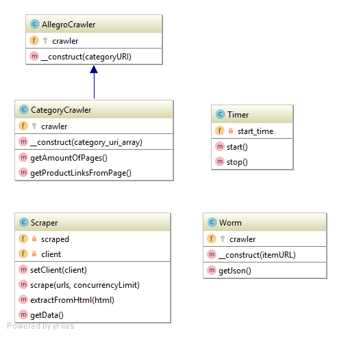

# Libraries

Application makes use of 4 custom classes, which, in CodeIgniter framework terminology, are called libraries. 

# Allegro Crawler

`Class AllegroCrawler`

Parent Crawler class which is used to scrap data from Allegro.
     

    class AllegroCrawler{
        /**
         * Object of type Symfony\Domcrawler\Crawler which hosts current crawler
         * @var \Symfony\Component\DomCrawler\Crawler
         */
        protected $crawler;
    
        /**
         * AllegroCrawler constructor.
         * @param $categoryURI - uri to be scrapped by crawler
         */
        public function __construct($categoryURI)
        {
            //Create new DOMDocument object which contains html not like string but like object
            $dom = new DOMDocument('1.0');
            //Load content from provided link to this object
            @$dom->loadHTMLFile($categoryURI);
    
            //Create crawler on this object and mark base url as allegro main url
            $this->crawler = new \Symfony\Component\DomCrawler\Crawler($dom, 'https://allegro.pl/');
        }
    }

# Category Crawler

`Class CategoryCrawler`

Crawler which is used to scrap CATEGORY pages at allegro (class Worm is used to scrap product pages).

    class CategoryCrawler extends AllegroCrawler
    {
        /**
         * This crawler object
         * @var
         */
        protected $crawler;
    
        /**
         * CategoryCrawler constructor.
         * @param array $category_uri_array - category link from which crawler has to scrap content, has to be an array due to framework limitations
         */
        public function __construct(array $category_uri_array)
        {
            //get first (and only) item of an array
           $url =  $category_uri_array[0];
           //Invoke parent constructor and create crawler on this link
            parent::__construct($url);
        }
    
        /**
         * Function which returns amount of pages from current category
         * @return mixed
         */
        function getAmountOfPages()
        {
            //Get value from html element identified by [class="m-pagination__text"] which hosts value of max pages
            $numberOfPages = $this->crawler->filter('[class="m-pagination__text"]')->text();
            return $numberOfPages;
        }
    
    
        /**
         * Function that collects links to products from current category page
         * @return mixed - array of links
         */
        function getProductLinksFromPage()
        {
            //Extract Big div with items from page
            $div = $this->crawler->filter('[data-box-name="items container"]');
            //Extract Headers from big div which contain links to items
            $h2 = $div->filter('[class="_4462670  "],[class="_4462670 _7b0067f "]');
            //Extract Links from inside headers
            $anchors = $h2->filter('a');
            //Extract final uri's from links and push them to $linksArray
            $linksArray = $anchors->each(function (\Symfony\Component\DomCrawler\Crawler $node, $i) {
                $url=getCleanUrl($node->link()->getUri());
                return $url;
            });
            return $linksArray;
        }
    
    }

# Worm

`Class Worm`

Crawler which is used to scrap PRODUCT pages at allegro (class CategoryCrawler is used to scrap category pages)

    class Worm
    {
        /**
         * This crawler object
         * @var \Symfony\Component\DomCrawler\Crawler
         */
        protected $crawler;
    
        /**
         * Worm constructor.
         * Creates worm that scraps data from given itemURL
         * @param $itemURL
         */
        public function __construct($itemURL)
        {
            $this->crawler= new \Symfony\Component\DomCrawler\Crawler($itemURL,'https://allegro.pl/');
        }
    
    
        /**
         * Function that extracts data from allegro javascript and packs it to array
         * @return mixed - associative array with data
         */
        public function getJson(){
            //Extract <script> tag from allegro
            $text = $this->crawler->filter('[data-box-name="summary"]')->filter('script')->html();
    
            //Cut out json string from <script> tag, trim and process it so it will look like valid json
            $start = '"primarySlot":';
            $end = '"additionalServices"';
            $jsonstring = get_string_between($text,$start,$end);
            $stripped = str_replace($jsonstring, "{},",$text);
    
            //Further trim, process and decode html special character used for polish characters
            $json = html_entity_decode(rtrim(strstr($stripped,"{\""),";"));
            return json_decode($json,true);
        }
    
    }

# Scraper

 `Class Scraper`
 
 Class which creates 'virtual' browsers which open pages and scrap data from them.
 
    class Scraper
    {
        /**
         * Object of current browser client
         * @var
         */
        private $client;
    
        /**
         * Array of scrapped data
         * @var array
         */
        private $scraped = [];
    
        /**
         * Setter which allows to set current client
         * @param Browser $client
         */
        public function setClient(Browser $client){
            $this->client = $client;
        }
    
    
        /**
         * Main scrape function which scraps provided url's in a multi-threading manner using a queue
         * @param array $urls - array of urls to be scrapped
         * @param $concurrencyLimit - queue limit
         */
        public function scrape(array $urls = [], $concurrencyLimit)
        {
            //Create new queue with provided concurency limit
            $queue = new Clue\React\Mq\Queue($concurrencyLimit, null, function ($url) {
                //When client is in queue extract content from url
                return $this->client->get($url);
            });
            $this->scraped = [];
    
            foreach ($urls as $url) {
                //Populate queue with links
               $queue($url)->then(
                   //When queue processes link invoke next function
                    function (\Psr\Http\Message\ResponseInterface $response) {
                        //Extract data from html and write result to scrapped array
                        $this->scraped[] = $this->extractFromHtml((string) $response->getBody());
                    });
            }
        }
    
        /**
         * Function which is used to extract data from html document
         * @param $html - html document
         * @return mixed - array with data
         */
        public function extractFromHtml($html)
        {
            //Create new Worm and send it to html document
            $crawler = new Worm($html);
            $item = $crawler->getJson();
           return $item;
        }
    
        /**
         * Getter to return scrapped data
         * @return array - scraped data
         */
        public function getData()
        {
            return $this->scraped;
        }
    }
 

# Timer

`Class Timer`

Class which helps to measure time between processes.

    class Timer
    {
        /**
         * Starting time
         * @var
         */
        private $start_time;
    
        /**
         * Function which is used to start timer
         */
        public function start(){
            $this->start_time=microtime(1);
        }
    
        /**
         * Function which is used to stop timer
         * @return string - time
         */
        public function stop(){
            $end_time=microtime(1);
            return getTime($this->start_time,$end_time);
        }
    }