# Interface Overview

Application interface consists of 3 main parts:

1. Top bar Menu

    

2. Side bar Menu

    

3. Application Plane

Top bar and side bar are used to navigate between application modules and pages.

Application Plane contains application windows and usually is different for different modules.

# Basic Exemplary Usage

1. Open Application in a Web Browser
2. Click `Extract` menu option button on sidebar

    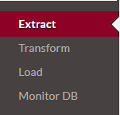
    
3. Provide amount of pages between **1** and **maximum** offered by application.

    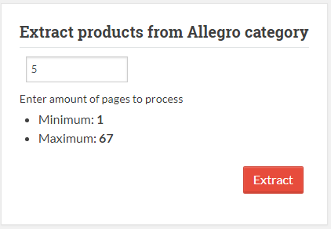
    
4. Click `Extract` button.
5. Wait until Extract process finishes.
6. Click `Transform` menu option button on sidebar.
    
    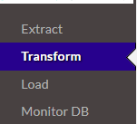
    
7. Choose set of attributes which you are willing to transform and aggregate.
    
    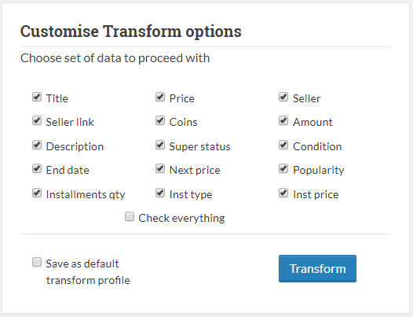
    
8. Click `Transform` button.
9. Wait until Transform process finishes.
6. Click `Load` menu option button on sidebar.
   
    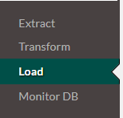
    
7. Provide amount of rows you are willing to load into data warehouse.
   
    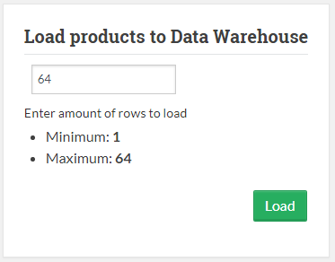
    
8. Click `Load` button.
9. Wait until Load process finishes.
10. Navigate to `Monitor DB -> L: SQL` menu option on sidebar to observe Data Warehouse.
   
    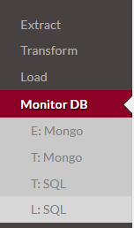

# Detailed Feature Usage

To open main application interface locate **Home** button on a top bar menu and press it.

Alternatively, chose one of the modules at side bar menu and click respective button to navigate to this module.

## Top bar navigation

Top bar menu consist of 3 elements:
* **Home** - main gui for the ETL process.
* **Settings** - global configuration for the application. Description of available configuration options can be found at [Settings](#application-settings) page.
* **Documentation** - link to project documentation.

## Side bar navigation

Sidebar consists of 4 modules:

- **Extract** - standalone Extract module, allows user to scrap data from Allegro page and put it into temporal database.
- **Transform** - standalone Transform module, allows user to specify data set which will be aggregated and processed from extracted data.
- **Load** - standalone Load module, allows user to perform process of loading transformed data to target data-warehouse.
- **Monitor DB** - CRUD-like analysing and monitoring module, allows user to analyse data at every step of ETL process.
    - **E: Mongo** (Extract MongoDB) - interface which allows user to query Mongo DB Collection `products` where raw data from html lands.
    - **T: Mongo** (Transform MongoDB) - interface which allows user to query Mongo DB Collection `aggregated` where aggregated selected data lands during transform.
    - **T: SQL** (Transform SQL) - interface which allows user to query SQL Table with structured data with converted data-types after full transform.
    - **L: SQL** (Load SQL) - interface which allows user to query SQL Table which represents target Data Warehouse.

# ETL Home Main Application

This page can be accessed by clicking **Home** button.

Main application consists of 4 windows, which represent 4 modules to configure before running ETL process.

Extract options window allows to set value which tells how much pages would be extracted from Allegro category.

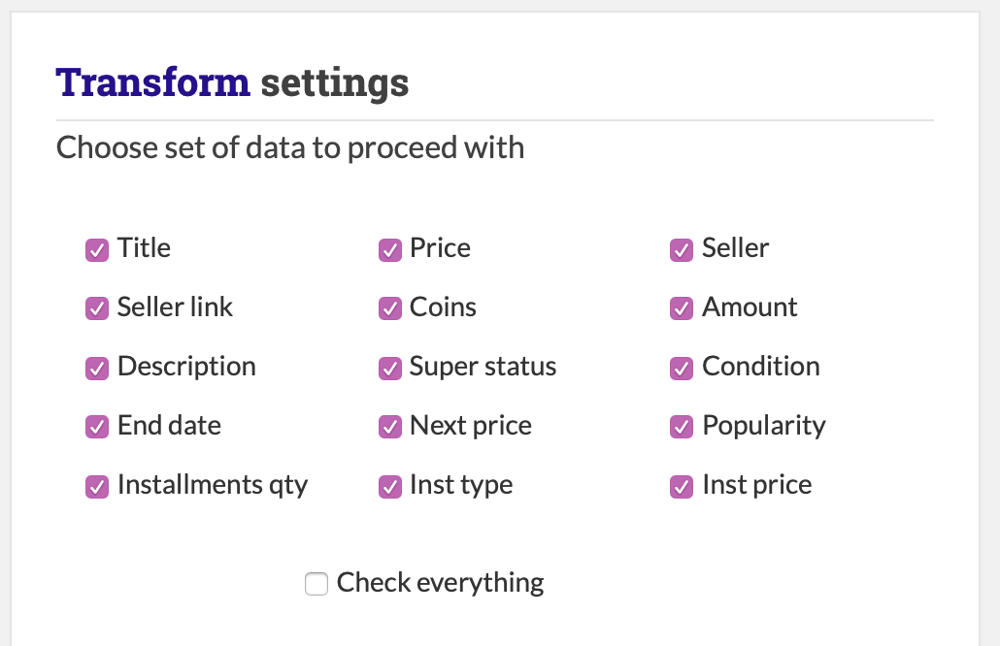

Transform options window allows to specify a set of parameters which will be chosen to aggregate and transform.

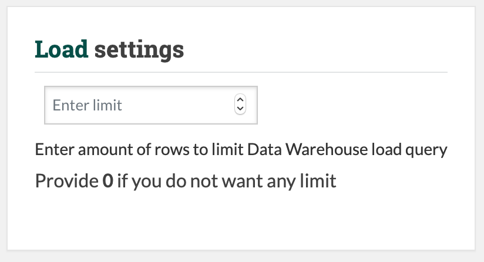

Load options window allows to set a limit on how many of extracted records will be inserted into data warehouse.

Providing 0 results means there will be no limit.

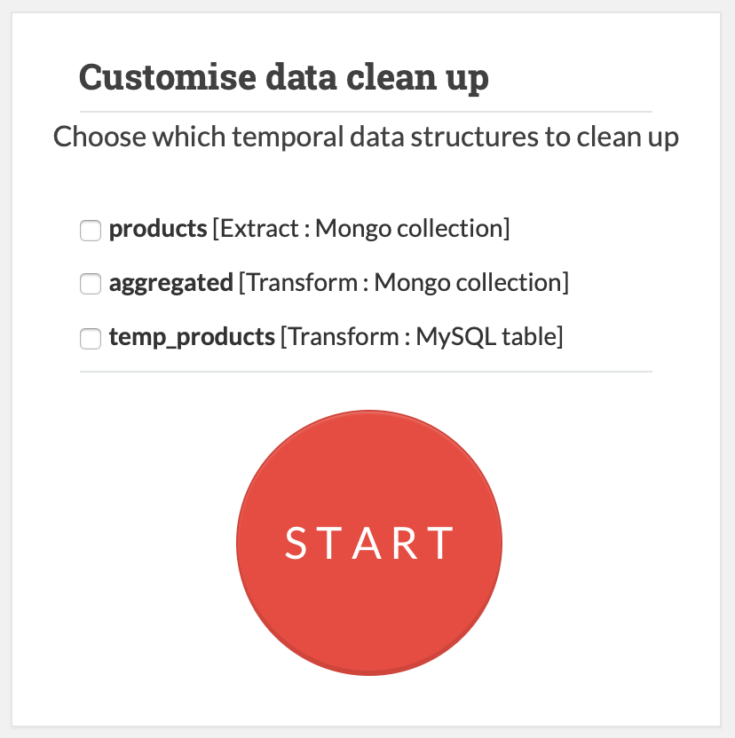

Final window allows to chose a set of temporal data structures which will be cleaned up after ETL process. 

And a **BIG RED** button to start ETL process.

# Extract Module

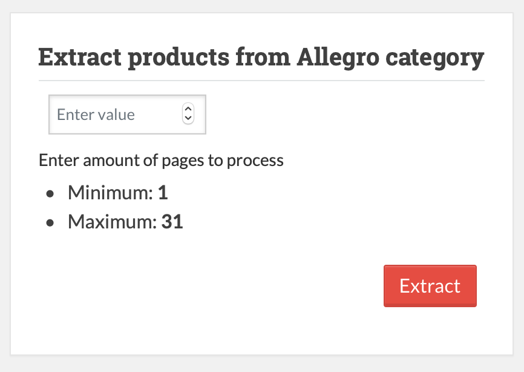

This module allows to configure and run **Extract** part of ETL process.

Following configuration window prompts user to provide amount of pages to extract from current Allegro category.

This amount should be not less than **1** and not more than maximum amount of pages, which is a dynamic value and is taken from current allegro category.

# Transform Module

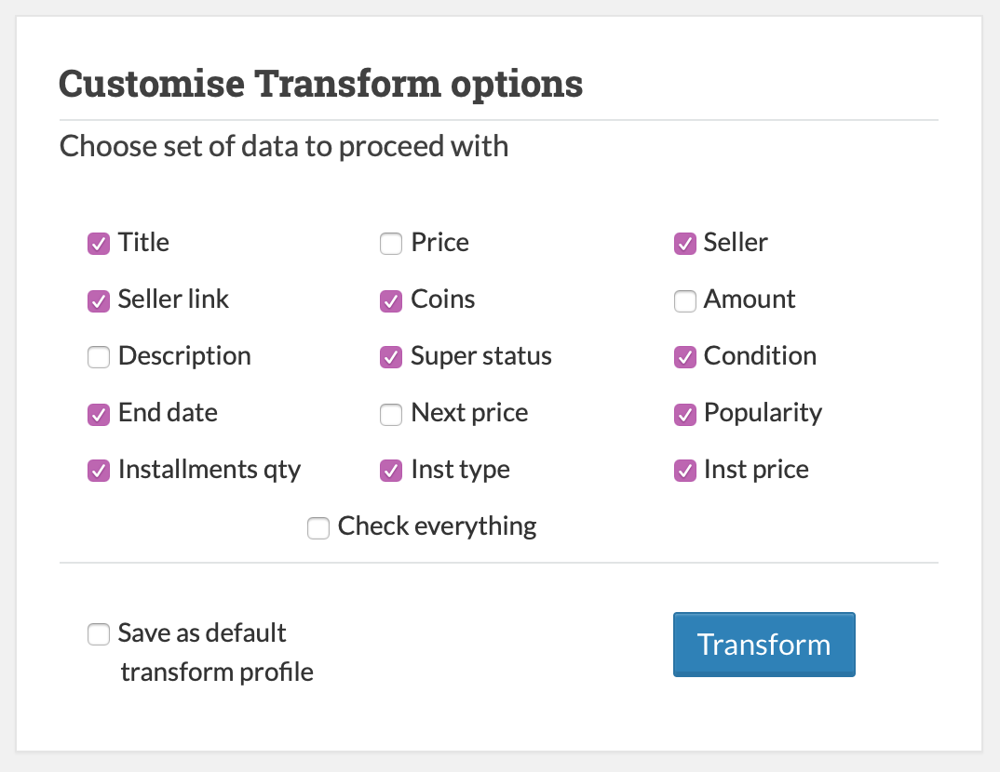

This module allows to configure and run **Transform** part of ETL process.

Transform options window allows to specify a set of parameters which will be chosen to aggregate and transform.

If "Save as default transform profile" checkbox is checked, your current selection will be saved as a default for future runs.

# Load Module

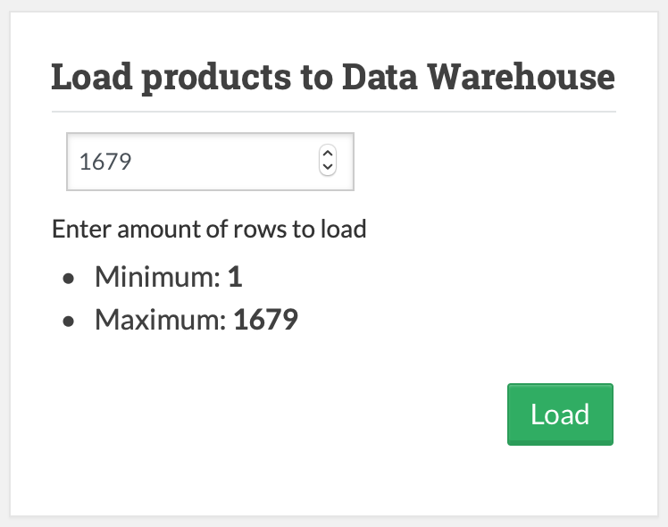

This module allows to configure and run **Load** part of ETL process.
which we want to load to Data Warehouse.

This amount should not be less than **1** and not more than maximum amount of rows in temporal table left after **Transform** process.

# Database Monitoring

This module is a CRUD-like analysing and monitoring module, which allows user to analyse data at every step of ETL process.

## SQL Monitoring

Monitoring interface consists of two parts:

1. Query builder module

    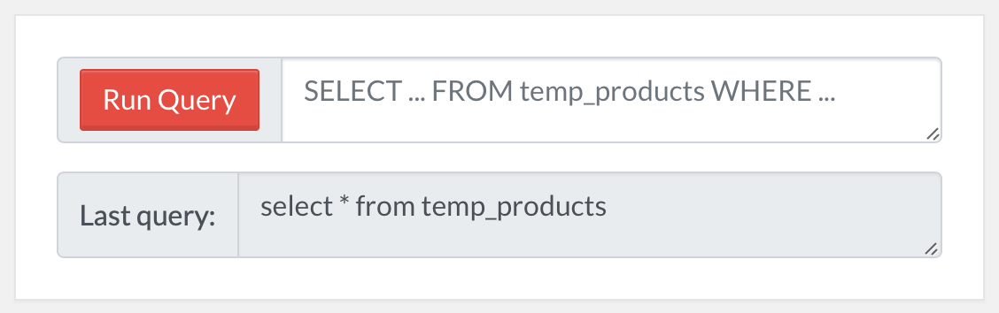
    
    Upper area can be used to provide SQL query to the current table. Please, note, that only valid SELECT query 
    to only this table will be accepted.
    
    Lower area contains last performed query. It might be useful for copying previous query for modification
    
2. Query Result table

    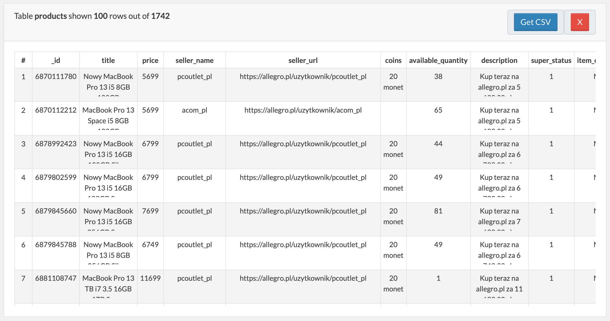

This table contains result of the last performed query.

It also might contain (depending on the table) additional buttons which allow to delete everything from current table
or dump last query result into csv file. 

## MongoDB Monitoring

Monitoring interface consists of two parts:

1. Filter builder module
    
    Upper area can be used to provide MongoDV filter to the current table. Please, note, that only filter in valid JSON format
    will be accepted.
        
    Lower area contains last performed query. It might be useful for copying previous query for modification
        

# Application Settings

This module is accessible by clicking **Settings** at the top bar.

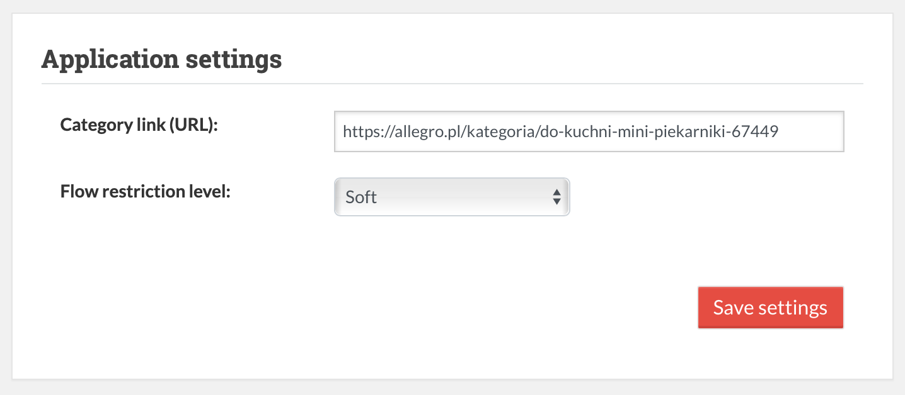

**Category link (URL)** - link to Allegro category, which application will use as a data source for ETL process.

**Flow restriction level** - option which allows to regulate restrictions on order of performing ETL processes (Extract, Transform, Load).
More on it in the section below.

## Flow restriction level

At any given point of time whole application is at one of the three possible phases. This phases correspond to ETL processes and phase tells what module should be ran next.

For example, if we just performed **Extract** then application is at _Transform_ phase -> application expects that next module that we will run will be **Transform**.

**Flow restriction level** option allows us to configure this application behavior and to enforce order of execution of modules **Extract**, **Transform**, **Load** if they are ran separately from sidebar.

There are 3 possible levels of flow restriction:

* **Development** - any module might be ran in any order. 
* **Strict** - only module which is equal to the application phase can be ran. Processes are only possible to run consequently.
* **Soft** - at any phase it is possible to repeat previous process or proceed to next one. 

Following table summarises which modules are available at which phase.

| Restriction level| Phase | Module |
--------|---------|---------
Development | Any | Any
Strict | Extract | Extract
Strict | Transform | Transform
Strict | Load | Load
Soft | Extract | Load or Extract
Soft | Transform | Extract or Transform
Soft | Load | Transform or Load

If user will try to access wrong module he will see following `error` with a hint on which module should be used now.

