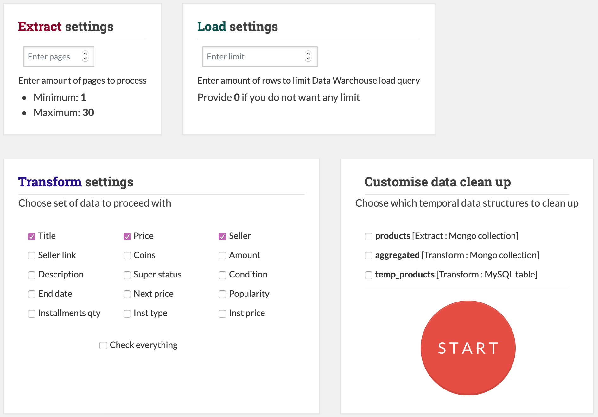
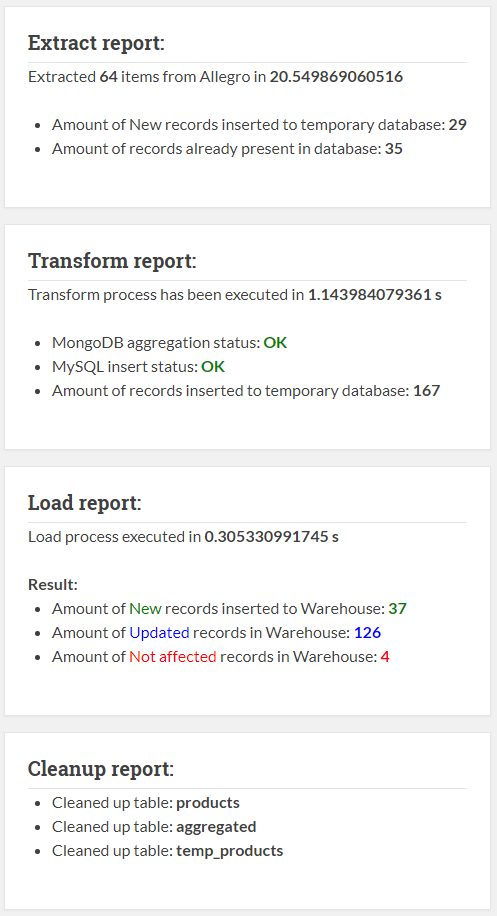
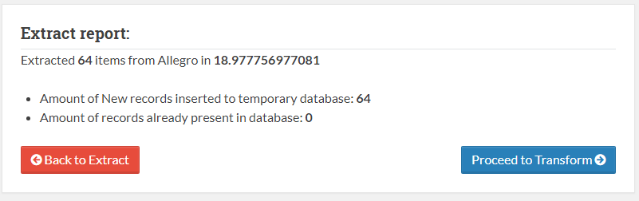
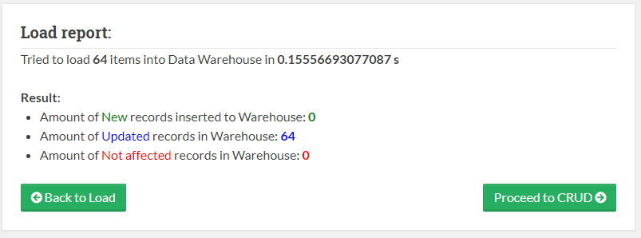

# Application Views

Application views are grouped into 3 main categories:

1. **Templates**
2. **Pages**
3. **Errors**

# Templates

This category of views are used to build page from structural parts.

It consists of 5 template parts:

1. `meta.php`
1. `topbar.php`
1. `sidebar.php`
1. `footer.php`
1. `script.php`

The body of application page hast to be placed between sidebar and footer element of the template.

`meta.php` - this file contains header of the webpage and loads css files.

    <?php
    
    ?>
    <!DOCTYPE html>
    <!--[if IE 8]><html class="no-js lt-ie9" lang="en" > <![endif]-->
    <!--[if gt IE 8]><!--> <html class="no-js" lang="en" > <!--<![endif]-->
    <head>
    	<meta charset="utf-8">
    	<meta http-equiv="X-UA-Compatible" content="IE=edge">
    	<meta name="viewport" content="width=device-width, initial-scale=1.0">
    	<meta name="description" content="UEK CI Documentation">
    	<meta name="author" content="Viacheslav Babanin">
    	<?=link_tag('img/afav.png', $rel="shortcut icon", $type='')?>
    	<title>Exstract Transform Load</title>
    
    	<?=link_tag('css/bootstrap.min.css')?>
    	<?=link_tag('css/jquery-ui.min.css')?>
    	<link href='https://fonts.googleapis.com/css?family=Lato:400,700|Roboto+Slab:400,700|Inconsolata:400,700' rel='stylesheet' type='text/css'>
    	<link href='https://maxcdn.bootstrapcdn.com/font-awesome/4.7.0/css/font-awesome.min.css' rel='stylesheet' type='text/css'>
    	<?=link_tag('css/theme.css')?>
    	<?=link_tag('css/theme_extra.css')?>
    	<?=link_tag('css/highlight.css')?>
    	<?=link_tag('css/uek.css')?>
        <?=link_tag('css/jquery.json-viewer.css')?>
        <?=link_tag('css/jquery-confirm.min.css')?>
    
    
    </head>
    <body class="wy-body-for-nav" role="document">
    

    
    
`topbar.php` - this file contains html code which is responsible for top-bar navigation menu.

    <section data-toggle="wy-nav-shift" class="wy-nav-content-wrap">
    	

    		<ul class="button-left">
    			<li onclick="location.href='<?=base_url('home')?>';"><i class="fa fa-home"></i> Home</a></li>
    		</ul>
            <ul class="button-left">
                <li onclick="location.href='<?=base_url('settings')?>';"><i class="fa fa-cogs"></i> Settings</a></li>
            </ul>
            <ul class="button-left">
                <li onclick="location.href='<?=base_url('docs')?>';"><i class="fa fa-book"></i> Documentation</a></li>
            </ul>
    	

    	<nav class="wy-nav-top" role="navigation" aria-label="top navigation">
    		<i data-toggle="wy-nav-top" class="fa fa-bars"></i>
    		<a href=".">Admin Panel Centrum Informatyki</a>
    	</nav>
    	

    		

    			

    				

    				
`sidebar.php` - this file contains html code which is responsible for side-bar module navigation menu.   				

    <nav data-toggle="wy-nav-shift" class="wy-nav-side stickynav">
    		

    			<a href="." class="icon icon-home"> Extract Transform Load</a>
    		

    		

    			<ul class="<?=$current==='extract' ? 'current' : ''?>">
    				<li class="toctree-l1 <?=$current==='extract' ? 'current' : ''?>">
    					<a class="<?=$current==='extract' ? 'current' : ''?>" href="<?=base_url()?>extract">Extract</a>
    				</li>
    			</ul>
    			<ul class="<?=$current==='transform' ? 'current' : ''?>">
    				<li class="toctree-l1 <?=$current==='transform' ? 'current blue' : ''?>">
    					<a class="<?=$current==='transform' ? 'current blue' : ''?>" href="<?=base_url()?>transform">Transform</a>
    				</li></ul>
                <ul class="<?=$current==='load' ? 'current' : ''?>">
                    <li class="toctree-l1 <?=$current==='load' ? 'current green' : ''?>">
                        <a class="<?=$current==='load' ? 'current green' : ''?>" href="<?=base_url()?>load">Load</a>
                    </li></ul>
                <ul class="<?=$current==='crudhome' ? 'current' : ''?>">
                    <li class="toctree-l1 <?=$current==='crudhome' ? 'current' : ''?>">
                        <a class="<?=$current==='crudhome' ? 'current' : ''?>" href="<?=base_url()?>crudhome">Monitor DB</a>
                        <ul class="current subnav">
    						<li class="toctree-l2 toc-item <?=$toccurrent==='mongo/products' ? 'toc-current' : ''?>">
    							<a href="<?php echo base_url();?>mongo/products" title="Extract Mongo CRUD">E: Mongo</a>
    						</li>
                            <li class="toctree-l2 toc-item <?=$toccurrent==='mongo/aggregated' ? 'toc-current' : ''?>">
                                <a href="<?php echo base_url();?>mongo/aggregated" title="Transform Mongo CRUD">T: Mongo</a>
                            </li>
                            <li class="toctree-l2 toc-item <?=$toccurrent==='sql/temp_products' ? 'toc-current' : ''?>">
                                <a href="<?php echo base_url();?>sql/temp_products" title="Transform SQL CRUD">T: SQL</a>
                            </li>
                            <li class="toctree-l2 toc-item <?=$toccurrent==='sql/products' ? 'toc-current' : ''?>">
                                <a href="<?php echo base_url();?>sql/products" title="Load SQL CRUD">L: SQL</a>
                            </li>
    					</ul>
                    </li></ul>
    
    		

    	</nav>
    	
    	
`footer.php` - this file contains footer message as well as closing tags for elements and containers which were opened in upper templates.

    

    

    
    <footer>
    
    	

    
    	

    		<!-- Copyright etc -->
    
    		
© 2018 Viacheslav Babanin Uniwersytet Ekonomiczny w Krakowie

    
    	

    </footer>
    
    

    

    
    </section>
    

    
    

        
    
    
        
    

    
`script.php` - contains closing tags and javascript scripts. Detailed explanation is in **Frontend** chapter of this documentation

# Pages

This category of views contains web-pages which are part of the application. The file structure is as follows:

* **pages**
    * **crud**
        * `crudhome.php`
        * `mongocrud.php`
        * `sqlcrud.php`
    * **extract**
        * `extract_app.php`
        * `extract_result.php`
    * **load**
        * `load_app.php`
        * `load_result.php`
    * **transform**
        * `transform_app.php`
        * `transform_result.php`
    * `home.php`
    * `home_result.php`
    * `settings.php`
    

General structure of each page is that consists form one or more `

` elements which represent application windows on white background.

## Home

Home page consists of two html files: `home.php` and `home_result.php`.

* `home.php` - contains application windows for ETL process.

* `home_result.php` - displays ETL process report for the user. 

## Settings

* `settings.php` - file which contains html elements responsible for user interaction with current global application settings.

## Extract
Extract module page is generated by two html files `extract_app.php` and `extract_result.php`.

* `extract_app.php` - displays Extract process configuration application window.

* `extract_result.php` - displays Extract report.

## Transform

Extract module page is generated by two html files `extract_app.php` and `extract_result.php`.

* `transform_app.php` - displays Transform process configuration application window.

* `transform_result.php` - displays Extract report.

## Load

Extract module page is generated by two html files `extract_app.php` and `extract_result.php`.

* `load_app.php` - displays Extract process configuration application window.

* `load_result.php` - displays Extract report.

## Crud

Crud module consists of 3 views:

* `crudhome.php` - index page of a module which explains what kind of data is presented on subpages.
* `mongocrud.php` - dynamic view which presents content of MongoDB collection, both MongoDB Crud pages are generated using this view.
* `sqlcrud.php` - dynamic view which presents content of SQL table, both SQL Crud pages are generated using this view.

# Errors

This category of views consists of views which process and present user-friendly, human readable php errors.

Most of them are part of CodeIgniter framework except one, which generates error message due to invalid module access:

`error_wrongphase.php`

    

    

    
        
<h1>MODULE ACCESS ERROR</h1>
            <h4>Reason: </h4>
            

                Trying to use incorrect module
            

            <h4>Message:</h4>
        

            You are trying to access module incompatible with application phase.
        

        

        <b>Please visit compatible module:</b>
        <ul>
            <?php if ($phase == 'extract'):?>
            <li><a href="<?=base_url()?>extract">Extract - start ETL from here</a></li>
            <?php elseif ($phase == 'transform'):?>
                <li><a href="<?=base_url()?>transform">Transform - continue ETL workflow</a></li>
            <?php elseif ($phase == 'load'):?>
                <li><a href="<?=base_url()?>load">Load - finish ETL workflow</a></li>
           <?php endif;?>
    
        </ul>
    
    

    
This view presents user with a message which differs according to current application page.